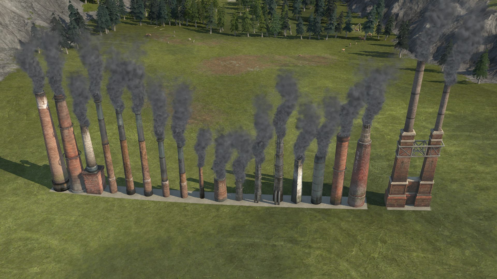

# The Chimney Collection

This mod contains ornamental chimneys. They are intended for filling gaps in industrial areas. There is a 1x1 version (16 variations) and a 2x1 version (1 variation).

You can find them in the construction menu at:
`Beautification menu (sorted by type) -> Industrial/Harbour -> Industrial decorations` or
`Beautification menu (sorted by release) -> Seasons -> Bright Harvest Ornaments`

As a bonus, they provide a buff on surrounding heavy industry buildings, reducing their negative attractiveness. This buff should encourage industrial beauty building on residential/cultural islands.

If you are using the iModYourAnno Mod Manager, you can adjust range and intensity of the buff using the Mod Tweaking system.
