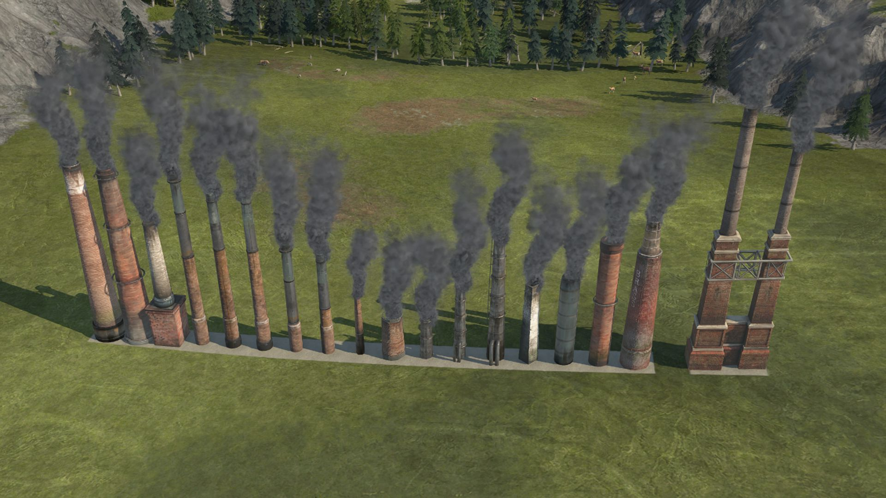

# Die Schlot-Sammlung

Diese Mod enthält zwei Schornstein-Ornamente: Eine 1x1-Version (16 Variationen) und eine 2x1-Version (1 Variation).

Im Baumenu findet man sie unter
`Ornament-Menu (sortiert nach Typ) -> Industrie/Hafen -> Industrielle Ornamente` oder bei
`Ornament-Menu (sortiert nach Veröffentlichung) -> Seasons -> Reiche Ernte`

Als kleinen Bonus geben sie einen Buff auf umliegende Gebäude der Schwerindustrie. Der Buff reduziert die negative Attraktivität. Der Buff soll dazu ermutigen und es verkraftbar machen, industriellen Schönbau auf Wohn- und Tourismusinseln zu betreiben.

Mit dem Mod-Tweaking-System des iModYourAnno Mod-Managers kann man Radius und Intensität des Buffs anpassen.